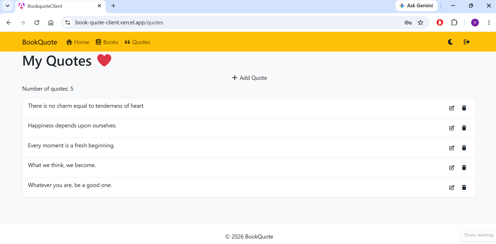
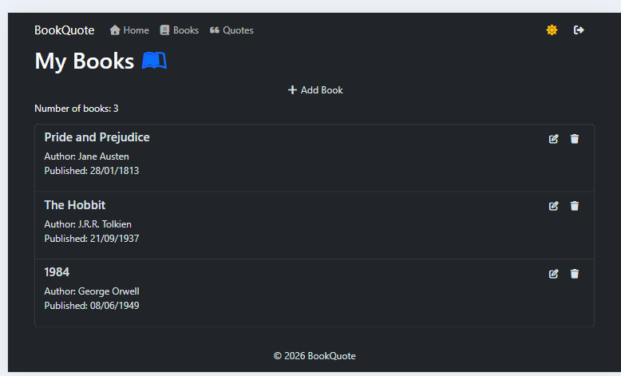
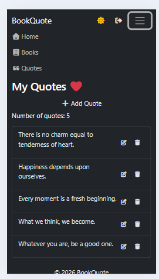
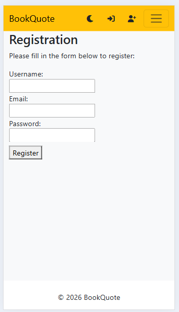

# ***BookQuote***

Welcome to my website for managing books & quotes!

## Overview

This project is a fullstack CRUD webapplication where the users can register, login, manage books and create their own quotes.

The application consists of an Angular frontend and a .NET Web API backend. Authentication is handled using JWT.

## Features

- User registration and login
- JWT-based authentication
- Password hashing with BCrypt
- CRUD operations for books
- CRUD operations for quotes
- User-specific quotes
- Protected API endpoints
- Responsive UI
- Light/dark theme

## Tech Stack

### Frontend
- Angular 20
- Bootstrap 5.3
- Font Awesome 7

### Backend
- C#
- .NET 9
- ASP.NET Core Web API
- Entity Framework Core 9
- SQLite

### Authentication
- JWT
- BCrypt

## Architecture

```text
Angular Frontend
       │
       │ HTTP / JSON
       ▼
ASP.NET Core Web API
       │
       ▼
Entity Framework Core
       │
       ▼
SQLite
```

## Project Structure
```text
BookQuote/
├── bookquote-client/      # Angular frontend
│   └── src/
│       ├── directives/
│       ├── features/
│       ├── interceptors/
│       ├── layouts/
│       ├── models/
│       └── services/
│
├── BookQuoteApi/          # .NET 9 backend
│   ├── Controllers/
│   ├── Data/
│   ├── DTOs/
│   ├── Migrations/
│   └── Models/
│
└── README.md
```

## Requirements
- .NET 9 SDK
- Node.js 24+
- npm 11+

## Installation

```bash
# Clone the repository
git clone https://github.com/VenusauRRR/BookQuoteApi.git

# Change directory: Backend
cd BookQuoteApi
dotnet restore
dotnet tool restore
dotnet ef database update
dotnet run
```
Open a new terminal to run the frontend:
```bash
# Change directory: Frontend
cd bookquote-client
npm install
npm start
```

## API

The backend exposes RESTful endpoints for authentication, books, and quotes.

| Method | Endpoint | Description |
|---|---|---|
| POST | `/api/users/register` | Register a user |
| POST | `/api/users/login` | Login |
| GET | `/api/books` | Get all books |
| POST | `/api/books/add` | Create a book |
| PUT | `/api/books/update/{id}` | Update a book |
| DELETE | `/api/books/delete/{id}` | Delete a book |
| GET | `/api/quotes/get-my-quotes` | Get user's quotes |
| POST | `/api/quotes/add` | Create a quote |
| PUT | `/api/quotes/update/{id}` | Update a quote |
| DELETE | `/api/quotes/delete/{id}` | Delete a quote |

## Configuration
The JWT signing key is stored using .NET User Secrets during local development and is not committed to the repository.
```bash
dotnet user-secrets init
dotnet user-secrets set "Jwt:Key" "your-secret-key"
```

## Authentication
The application uses JWT-based authentication. Users receive a JWT after successful login, which is included in authenticated API requests.

Protected endpoints require a valid JWT token.

## Deployment

- **Frontend (Vercel):** [BookQuote](https://book-quote-client.vercel.app)
- **Backend (Azure):** [BookQuote API](https://bookquoteapi-ewchevf8hphxevcf.swedencentral-01.azurewebsites.net)

## Screenshots






## Future Improvements
- Add unit and integration tests
- Improve form validation
